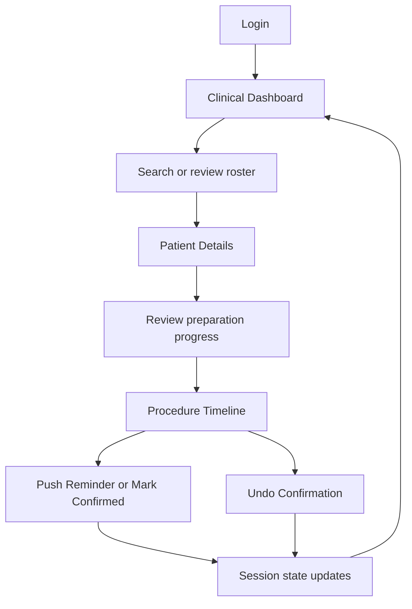
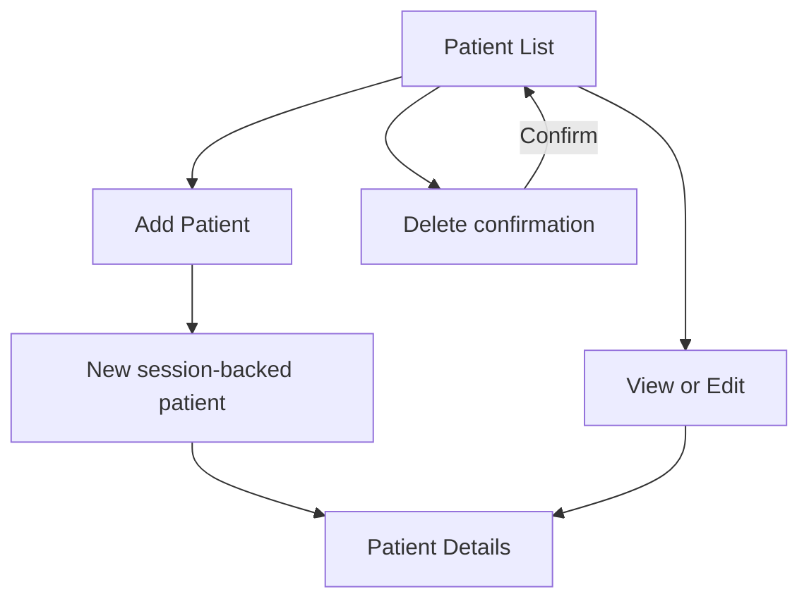

# PrepBuddy AI – Intelligent Pre-Procedure Preparation Management System

PrepBuddy AI is a Django-rendered clinical workflow prototype for monitoring patient preparation before a procedure. Its staff-facing interface brings patient records, procedure readiness, preparation milestones, and protocol reference information together in one place.

This README describes the frontend and the supporting Django behavior that is present in this repository. It does not describe a completed clinical backend or production integration. In particular, most patient and timeline data is demo data or stored in the browser user's Django session; it is not a persistent patient-record system.

## Contents

- [Project overview](#project-overview)
- [Frontend features](#frontend-features)
- [Pages and user flows](#pages-and-user-flows)
- [Project structure](#project-structure)
- [Routes](#routes)
- [UI and responsive behavior](#ui-and-responsive-behavior)
- [Patient management](#patient-management)
- [Procedure timelines](#procedure-timelines)
- [Protocols](#protocols)
- [State and data boundaries](#state-and-data-boundaries)
- [Testing](#testing)
- [Current status](#current-status)
- [Backend integration status and limitations](#backend-integration-status-and-limitations)
- [Run locally](#run-locally)

## Project overview

Pre-procedure preparation can involve multiple time-sensitive milestones. PrepBuddy AI's interface is intended to help clinic staff see which demo patients are ready, pending, or at risk, review patient and procedure information, and record staff actions against preparation steps.

The intended users represented in the UI are clinic staff and doctors. The current frontend provides:

- Authentication and role selection through Django's local user system.
- A dashboard with patient-level counts, an at-risk section, and an upcoming-procedure roster.
- Patient list, detail, add, edit, and delete screens.
- A procedure overview and individual timeline pages for the seeded demo patients.
- Static reference pages for three preparation protocols.

This is a workflow prototype. It is not a medical device, does not calculate clinical recommendations, and should not be used with real patient data.

## Frontend features

### Implemented in the current source

- **Login and registration pages:** Django form posts, CSRF tokens, messages, password matching and minimum-length checks at registration, duplicate account check, and clinic-staff/doctor role selection.
- **Logout:** POST form; Django authentication is logged out and the session is flushed.
- **Clinical dashboard:** procedure, ready, pending, and at-risk patient counts; patient-level at-risk rows; upcoming procedure rows; patient search.
- **Patient management:** roster search and status filter, profile/detail page, add/edit forms, and delete confirmation.
- **Patient preparation progress:** displays the step names, times, state messages, and controls supported by the current session-backed patient data.
- **Procedure overview:** `/procedures/` lists the patients returned by the demo/session patient-data helper and links to patient-specific timeline URLs.
- **Seeded patient timelines:** interactive, detailed timeline pages exist for Rahul Kumar, Priya Nair, and Ananya Sharma.
- **Timeline actions:** staff can send a reminder, mark an eligible step confirmed, and undo a confirmation. The recorded action is session state; no message is sent to an external patient channel.
- **Protocol reference:** list and detail pages for Colonoscopy Preparation, Upper GI Endoscopy, and Flexible Sigmoidoscopy.
- **Navigation and feedback:** shared authenticated navigation, active-section styling, Django messages, not-found states, and CSRF-protected forms.

### Important behavior boundaries

- Patient status is based on the step statuses supplied by the demo data and session actions. There is no clock-driven job that changes a step from pending to risk when a real confirmation window expires.
- The current timeline view uses a separate, hardcoded set of timeline data for Rahul, Priya, and Ananya. Session timeline actions can override those seeded steps. Newly added session patients appear in the overview and patient pages, but their individual detailed timeline is not dynamically built from their patient record and may show Procedure Not Found.
- The selected protocol on the patient form is saved as patient metadata, but patient creation currently initializes the same four fixed preparation steps rather than deriving steps from that selected protocol.
- Protocol pages are reference content in Python view data; they are not loaded from the patient records or a protocol database.
- A “WhatsApp Nudge”, “Push Reminder”, or “Send Reminder” button records a demo action in the session. It does not send WhatsApp or SMS messages.

## Pages and user flows

### Page reference

| Page | Route | Purpose and current functionality |
|---|---|---|
| Login | `/login/` | Accepts email and password and authenticates against Django users. Includes a registration link. The “Remember me” checkbox has no behavior, and “Forgot password?” is a placeholder link. |
| Register | `/register/` | Creates a Django user and `StaffProfile` with Clinic Staff or Doctor role. Checks required values, password equality, a six-character minimum, and duplicate username/email. |
| Dashboard | `/` | Shows counts, genuine seeded/session risk patients, and upcoming procedure rows. Search filters the roster and at-risk list. Dashboard counts represent patients, not the number of preparation steps. |
| Patient List | `/patients/` | Lists patients with status counts, text search, status filtering, and View/Edit/Delete links. |
| Add Patient | `/patients/add/` | Collects patient, procedure, date/time, physician, suite, and protocol fields. New custom records are stored in the current session and start with four pending steps. |
| Patient Details | `/patients/<patient_id>/` | Displays profile, procedure, preparation progress, and reminder/confirmation controls for the patient's current steps. Unknown IDs render a not-found state. |
| Edit Patient | `/patients/<patient_id>/edit/` | Edits patient metadata. Existing steps are carried over. The data is stored as a session-backed custom patient record. |
| Delete Patient | `/patients/<patient_id>/delete/` | Shows a confirmation screen and removes a custom patient from the current session on POST. Seeded built-in patients are not removed from the source data. |
| Procedure Timeline Overview | `/procedures/` | Lists patients with their procedure, scheduled time, status, and an Open Timeline link. The page is based on the same patient-data helper as the dashboard. |
| Individual Procedure Timeline | `/procedures/<patient_id>/` | Shows the detailed, hardcoded timeline for Rahul, Priya, and Ananya. Unknown or newly added patients may not have a timeline record. |
| Protocol List | `/protocols/` | Lists the three static preparation protocol references. |
| Protocol Detail | `/protocols/<protocol_type>/` | Displays the protocol description and ordered step names, suggested times, and descriptions. Unknown protocol keys currently fall back to Colonoscopy. |
| Django Admin | `/admin/` | Django's built-in admin site; it is not part of the custom PrepBuddy frontend. |

### Main staff workflow



The timeline link is available from patient details, the dashboard, and the procedure overview. Current detailed timeline data exists for the three seeded patients only.

### Patient-management workflow



Adding a patient stores the record in `request.session["custom_patients"]`. Editing preserves the existing steps and updates the session record. Deletion removes a custom record from that session. These operations do not create, update, or delete a persistent clinical patient record.

### Protocol workflow

From the shared navigation, open **Protocols**, choose one of the listed reference protocols, and review its description and ordered milestones. The protocol detail page links back to the protocol list.

## Project structure

```text
Frontend/
├── manage.py
├── db.sqlite3
├── prepbuddy/
│   ├── __init__.py
│   ├── asgi.py
│   ├── settings.py
│   ├── urls.py
│   └── wsgi.py
├── frontend/
│   ├── __init__.py
│   ├── admin.py
│   ├── apps.py
│   ├── models.py
│   ├── tests.py
│   ├── urls.py
│   ├── views.py
│   └── migrations/
│       ├── __init__.py
│       └── 0001_initial.py
├── static/
│   └── style.css
└── templates/
    ├── base.html
    ├── dashboard.html
    ├── login.html
    ├── patient_delete.html
    ├── patient_detail.html
    ├── patient_form.html
    ├── patient_list.html
    ├── procedures.html
    ├── procedure_timeline.html
    ├── protocol_detail.html
    ├── protocols.html
    └── register.html
```

`venv/` may also exist as a local virtual environment; it is not source code and is not required to be committed.

| File or directory | Purpose |
|---|---|
| `manage.py` | Django management command entry point. |
| `prepbuddy/settings.py` | Project settings, installed apps, middleware, template directory, SQLite configuration, static files, and login routes. |
| `prepbuddy/urls.py` | Includes the frontend URL configuration and exposes Django Admin. |
| `frontend/views.py` | Page rendering, seeded patient/protocol data, form handling, and session-based demo actions. |
| `frontend/urls.py` | Named page and action routes for the custom frontend. |
| `frontend/models.py` | Defines `StaffProfile`, a one-to-one role profile for a Django user. It does not define a patient or procedure model. |
| `frontend/migrations/` | Database migration for `StaffProfile`. |
| `frontend/tests.py` | Django `TestCase` regression tests for authentication, dashboard, patient flows, and procedure overview. |
| `templates/` | Django templates for the shared shell and all custom pages. |
| `static/style.css` | Shared styles, layout, component styles, and responsive breakpoints. |
| `db.sqlite3` | Local SQLite database configured for Django, including auth/session/profile data. It is not a persistent patient-record database. |

There is no separate frontend build system, package manifest, requirements file, static JavaScript bundle, or API client in the current project. The dashboard contains a small inline JavaScript filter.

## Routes

All custom pages except login and registration require an authenticated Django user. Forms use Django CSRF tokens. The `patients` and `patient_list` names are aliases for the same `/patients/` route.

| Route | Page/action | Purpose | Status |
|---|---|---|---|
| `/` | Dashboard (`dashboard`) | Dashboard counts, at-risk patients, and upcoming roster | Implemented; seeded/session data |
| `/patients/` | Patient List (`patients`, `patient_list`) | Search, filter, and manage patient records | Implemented; demo/session records |
| `/patients/add/` | Add Patient (`add_patient`) | Create a custom session-backed patient | Implemented; no patient database model |
| `/patients/<str:patient_id>/` | Patient Details (`patient_detail`) | View patient profile and preparation steps | Implemented for data returned by the patient helper |
| `/patients/<str:patient_id>/edit/` | Edit Patient (`edit_patient`) | Update metadata for a patient | Implemented; writes custom/session representation |
| `/patients/<str:patient_id>/delete/` | Delete Patient (`delete_patient`) | Confirm and remove a custom session patient | Implemented for custom patients; seeded data remains |
| `/procedures/` | Procedure Timeline Overview (`procedures`) | List available patients and link to timelines | Implemented; patient/session data source |
| `/procedures/<str:patient_id>/` | Individual Timeline (`procedure_timeline`) | View seeded patient timeline | Implemented for Rahul, Priya, and Ananya; not dynamically connected to new patient records |
| `/procedures/<str:patient_id>/confirm/<int:step_index>/` | Confirm Step (`confirm_step`) | Save a confirmed status for a timeline step | Implemented as session action |
| `/procedures/<str:patient_id>/undo/<int:step_index>/` | Undo Step (`undo_step`) | Restore a step to risk after undoing confirmation | Implemented as session action |
| `/procedures/<str:patient_id>/reminder/<int:step_index>/` | Send Reminder (`send_reminder`) | Record a reminder action and leave the step at risk | Implemented as session action; no external message is sent |
| `/protocols/` | Protocol List (`protocols`) | Display three protocol references | Implemented; static view data |
| `/protocols/<str:protocol_type>/` | Protocol Detail (`protocol_detail`) | Display protocol description and ordered steps | Implemented; unknown keys default to Colonoscopy |
| `/login/` | Login (`login`) | Sign in using Django authentication | Implemented |
| `/register/` | Register (`register`) | Create a Django user and staff profile | Implemented |
| `/logout/` | Logout (`logout`) | Log out and flush the current session | Implemented; used as a POST form |
| `/admin/` | Django Admin | Framework-provided admin route | Django built-in; not a custom PrepBuddy page |

## UI and responsive behavior

- **Typography:** Inter, loaded from Google Fonts, with a sans-serif fallback.
- **Base palette:** white surfaces over a pale blue-gray page background, dark blue-gray text, and indigo accents.
- **Status colors:** green for ready/confirmed, amber for pending, and rose/red for risk/overdue.
- **Layout:** sticky desktop navbar, centered main content, dashboard metric cards, roster tables, patient/procedure panels, and protocol lists.
- **Controls:** consistent button and status-badge styles; forms include labels, native input types, and visible Django messages.
- **Patient avatars:** initials generated from patient names, styled as colored square avatars.
- **Risk UI:** risk panel and overdue badges visually distinguish seeded or action-recorded at-risk steps.
- **Responsive CSS:** metric cards reduce to two columns around 1000px and one column around 650px. At widths below 900px, roster tables retain a wide minimum width and scroll horizontally. The navbar links are hidden below 650px; there is currently no mobile menu to replace them.

The shared layout and component styles are in `static/style.css`; all pages use `templates/base.html`. No separate icon package or design-system dependency is configured.

## Patient management

The patient list combines three source-code demo records (Rahul, Priya, and Ananya) with custom patient data in the current Django session. Patient search matches name, ID, procedure, physician, and suite; the list also supports a patient-status filter.

The patient form captures ID, name, gender, age, phone, email, procedure, procedure date/time, physician, suite, and protocol. Browser validation uses required fields, email input type, and a positive minimum for age. Server-side handling checks required values, validates positive numeric age during add, rejects duplicate IDs, and checks duplicate IDs during edit. This is form validation for the prototype, not a substitute for domain validation on a future patient API.

Patient-level status is derived from steps:

1. `ready` when all steps are confirmed.
2. `risk` when at least one step is risk and not all steps are confirmed.
3. `pending` otherwise.

Counts are patient-level rather than step-level. Newly added records initialize the same four fixed Colonoscopy-named steps as pending, regardless of the protocol selected in the form. Custom patient data and preparation changes are session-backed, so they are not durable across session expiry or available to other users.

## Procedure timelines

The procedure overview at `/procedures/` lists current demo/session patients and their patient-level status. Its **Open Timeline** link uses Django URL reversing to target `/procedures/<patient_id>/`.

The detailed timeline is currently driven by a separate static dictionary for Rahul, Priya, and Ananya. Seeded timeline statuses include confirmed, risk, and pending steps. It displays step time, name, status, explanatory text, reminder channel, and a scheduled/sent description.

On the detailed timeline, the seeded risk milestone offers **Push Reminder** and **Mark Confirmed**. Confirmed steps offer **Undo Confirmation**. These actions write a per-patient/per-step entry to `request.session["timeline_actions"]`; no asynchronous scheduling, real-time overdue detection, SMS/WhatsApp delivery, or external notification is implemented. A reminder keeps the demo step in risk with an updated description. Undo writes the step back to risk.

Patient Details has its own per-step controls and also displays a WhatsApp-labeled nudge button. That label is UI copy only; the action is still the local session-backed reminder view.

## Protocols

The Protocols page presents three reference entries:

| Protocol | Steps shown |
|---|---|
| Colonoscopy Preparation | Avoid solid foods (18:00), take first prep dose (20:00), take second prep dose (02:00), final confirmation (05:00) |
| Upper GI Endoscopy | Begin fasting (22:00), continue clear liquids (05:00), final confirmation (06:00) |
| Flexible Sigmoidoscopy | Light diet (18:00), administer enema (06:00), final confirmation (07:00) |

Each detail page shows department, step count, summary, and step descriptions. These are static reference entries in `frontend/views.py`; there is no protocol editing, database model, or automatic protocol-to-patient step generation yet.

## State and data boundaries

| Data or behavior | Current source of state |
|---|---|
| Staff accounts | Django `User` records in the configured SQLite database |
| Staff roles | `StaffProfile` model in SQLite (`clinic_staff` or `doctor`) |
| Login state | Django authentication session |
| Staff display values | Additional `user_id`, `user_name`, and `user_role` session keys |
| Built-in patients | Python dictionary `PATIENTS` in `frontend/views.py` |
| Added/edited patient records | `custom_patients` in the current Django session |
| Timeline actions | `timeline_actions` in the current Django session |
| Detailed timeline baseline | Static patient/step dictionary inside `procedure_timeline()` |
| Protocol definitions | Static dictionaries inside `protocol_detail()`; list cards in the template |
| Search interactions | Django query/context filtering plus inline dashboard JavaScript for immediate roster filtering |

The configured SQLite database and migrations support Django authentication, sessions, and `StaffProfile`. There is no patient, procedure, preparation-step, or protocol model in this repository. The SQLite database is therefore not evidence of persistent patient-management functionality.

## Testing

Tests use Django's `django.test.TestCase` and the Django test client. `frontend/tests.py` currently contains **9 tests** covering:

- Login and session profile fields.
- Guest navigation on the login page.
- Protected-page redirect and logout session flush.
- Dashboard search and timeline action state reflected on patient details.
- Adding a patient and the patient list page.
- New patient pending initialization and exclusion from the at-risk step list.
- Procedure timeline overview rendering.
- One dashboard action set per at-risk patient.
- Patient edit and delete flow.

The tests do not cover all templates, protocol content, invalid timeline IDs, responsive rendering, real message delivery, or production security. In this workspace, the suite was run with Django 6.1.1: **9 tests passed**. Run the command below after changes to verify the current environment.

## Current status

| Module | Status | Notes |
|---|---|---|
| Authentication UI and local auth | Implemented | Uses Django authentication and SQLite-backed users/profile; production identity integration is not configured. |
| Dashboard | Implemented as prototype | Counts and lists use seeded/session data; there is no live clinical feed. |
| Dashboard search | Implemented | Search is available on the dashboard roster; patient list has server-side search and status filtering. |
| Patient management | Demo/session implementation | Add/edit/delete UI exists, but there is no patient database model or API. |
| Patient details and preparation progress | Implemented as prototype | Renders current helper data and supports session actions. |
| Procedure overview | Implemented | Lists helper patient data and links to individual timeline routes. |
| Individual procedure timeline | Partially integrated | Detailed timeline is hardcoded for Rahul, Priya, and Ananya; newly added session patients are not wired into it. |
| Timeline actions | Demo/session implementation | Confirm, undo, and reminder actions update session state only. |
| Protocol references | Implemented as static content | Three read-only protocols; selected protocol does not generate patient steps. |
| Responsive styling | Implemented with limitations | Breakpoint CSS exists; table scrolling is used and mobile navbar links are hidden. |
| Automated tests | 9 tests present | Covers key auth, dashboard, patient CRUD, and overview flows; execute locally to verify. |

## Backend integration status and limitations

This README documents the frontend implementation and its directly supporting Django prototype behavior only.

### Present now

- Django server-rendered templates and views.
- Django authentication backed by the configured local SQLite database.
- A `StaffProfile` model for staff role metadata.
- Django session storage for custom demo patient records and timeline actions.
- Static demo patient, timeline, and protocol data.

### Not implemented in this repository

- Persistent patient, procedure, preparation-step, or protocol records.
- A REST/GraphQL API or frontend API client.
- Dynamic overdue-window calculation, background scheduling, or real-time updates.
- Actual SMS/WhatsApp delivery or notification provider integration.
- An AI assistant/model integration.
- Redis/Celery configuration.
- Production deployment configuration or production authentication integration.

Before any clinical or production use, the project needs a reviewed backend and data model, server-side validation and authorization for clinical records, reliable scheduling and notification integrations, production secret/configuration handling, privacy/security review, and appropriate clinical workflow validation. The current development settings contain `DEBUG = True`, an insecure development secret key, and an empty `ALLOWED_HOSTS`; they are not production-ready.

## Run locally

### Requirements

- Python with Django installed. The current workspace was verified with Django 6.1.1.
- This repository does not include `requirements.txt`, `pyproject.toml`, or another dependency lock/manifest. Django 6.1.1 is the verified version for this workspace, not a version pinned by a project dependency file. Check an environment with `python manage.py --version`.
- No environment variables are read by the current settings.

### Windows PowerShell

From the project root:

```powershell
python -m venv venv
Set-ExecutionPolicy -Scope Process -ExecutionPolicy RemoteSigned
.\venv\Scripts\Activate.ps1
python -m pip install "Django==6.1.1"
python manage.py migrate
python manage.py runserver
```

If this workspace's `venv` already exists and Django is installed, activate it and continue from `python manage.py migrate`.

### macOS or Linux

```bash
python3 -m venv venv
source venv/bin/activate
python -m pip install "Django==6.1.1"
python manage.py migrate
python manage.py runserver
```

Open <http://127.0.0.1:8000/>. The dashboard and other protected pages redirect to `/login/` until you register an account at `/register/` or create a user through Django Admin. Migrations create the Django tables and the `StaffProfile` table; patient demo records are supplied by the application and do not require database seeding.

Run the frontend regression tests with:

```bash
python manage.py test frontend.tests
```

Do not deploy with the current development settings or use real patient information in this prototype.